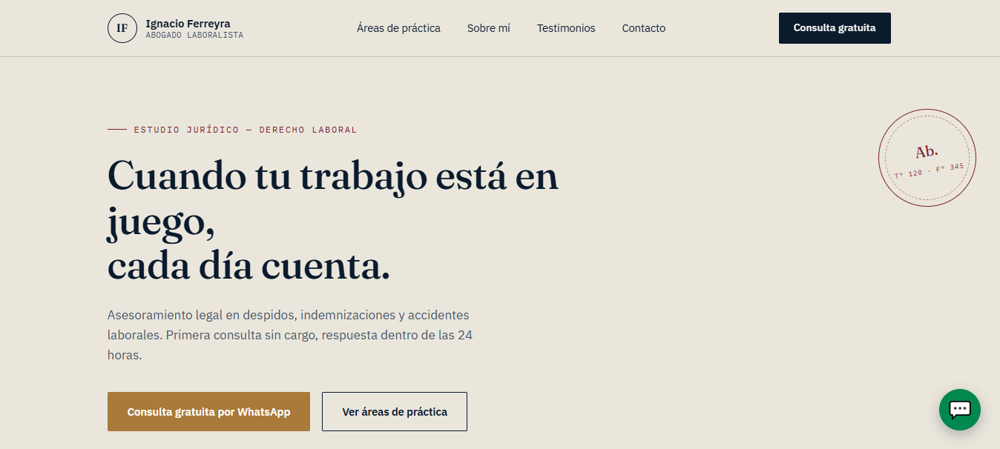

# ⚖️ Estudio Jurídico — Sitio Web Institucional

Repositorio del sitio web institucional para estudio de abogados / profesional independiente. Desarrollado con tecnologías web puras (**HTML5, CSS3 y JavaScript vanilla**), priorizando rendimiento, SEO local, accesibilidad y conversión directa de clientes.


---

## 📌 Tabla de Contenidos

1. [Visión General del Proyecto](#-visión-general-del-proyecto)
2. [Estructura de Archivos](#-estructura-de-archivos)
3. [Requisitos y Stack Tecnológico](#-requisitos-y-stack-tecnológico)
4. [Instalación y Uso Local](#-instalación-y-uso-local)
5. [Estrategia de Frontend y UX/UI](#-estrategia-de-frontend-y-uxui)
6. [Integración del Formulario de Contacto (Backend Serverless)](#-integración-del-formulario-de-contacto-backend-serverless)
7. [Optimizaciones SEO y Metadatos](#-optimizaciones-seo-y-metadatos)
8. [Despliegue / Hosting](#-despliegue--hosting)

---

## 🎯 Visión General del Proyecto

El objetivo principal es brindar una presencia digital seria, sólida y confiable que convierta visitantes en clientes.

### Principales Objetivos:

- **Generar Confianza:** Destacar número de matrícula profesional, colegio de abogados y trayectoria desde la portada (_Hero section_).
- **Fácil Contacto:** Integración con botón flotante de WhatsApp y formulario directo.
- **SEO Local:** Marcado de datos estructurados (`Schema.org / LegalService`) para mejorar visibilidad en Google Search y Maps.
- **Carga Ultrarrápida:** Arquitectura multipágina (MPA) estática sin dependencias pesadas ni frameworks superfluos.

---

## 📁 Estructura de Archivos

````text
Demo-Abogado/
├── index.html              # Página principal (Hero, Servicios, Sobre mí, CTA)
├── areas-de-practica.html  # Detalle completo de servicios jurídicos
├── sobre-nosotros.html     # Trayectoria, equipo, matrícula y colegiación
├── contacto.html           # Formulario principal, mapa y vías de contacto
├── blog/
│   └── articulo-1.html     # Artículos educativos y guía de dudas frecuentes
├── css/
│   ├── reset.css           # Normalización de estilos base entre navegadores
│   └── styles.css          # Variables globales, layout y componentes
├── js/
│   └── main.js             # Menú mobile, validación de forms y animaciones
├── img/
│   └── (imágenes)          # Fotografías e íconos en formato WebP optimizado
└── legal/
    ├── privacidad.html     # Política de Privacidad (cumplimiento Ley 25.326)
    └── terminos.html        # Términos y Condiciones / Aviso Legal

## 🛠️ Requisitos y Stack Tecnológico

* **HTML5:** Semántica pura (`header`, `nav`, `main`, `section`, `article`, `footer`).
* **CSS3:** Flexbox, CSS Grid, Variables CSS (`:root`) para temas de color y diseño 100% *Responsive / Mobile-First*.
* **JavaScript (ES6+):** Código nativo sin librerías externas para manipulación de DOM y Fetch API.
* **Backend de Formulario:** Google Apps Script + Google Sheets (o Web3Forms / Formspree).
* **Control de Versiones:** Git & GitHub.

---

## 🚀 Instalación y Uso Local

1. **Clonar el repositorio:**
   ```bash
   git clone [https://github.com/MatiasDeArriba/Demo-Abogado.git](https://github.com/MatiasDeArriba/Demo-Abogado.git)
````

## Acceder al directorio:

Bash
cd Demo-Abogado
Ejecutar en entorno local:

Abrí index.html directamente en tu navegador preferido.

Opcional: Si usás VS Code, podés instalar la extensión Live Server, hacer clic derecho sobre index.html y seleccionar Open with Live Server.

## 🎨 Estrategia de Frontend y UX/UI
Paleta de Colores:

Azul Marino (#0B1D3A): Transmite solidez, elegancia y autoridad legal.

Dorado / Bronce (#C5A059): Acento para botones principales y detalles de jerarquía.

Gris Claro / Marfil (#F8F9FA): Fondos limpios para facilitar la lectura.

Tipografías:

Playfair Display / Merriweather (Serif): Títulos principales y sellos visuales.

Inter / Roboto (Sans-serif): Texto de cuerpo y formularios para lectura ágil en pantallas pequeñas.

📩 Integración del Formulario de Contacto (Backend Serverless)
El formulario de contacto utiliza Fetch API enviando un payload JSON hacia un endpoint de Google Apps Script.

Diagrama de Flujo:
El usuario completa nombre, teléfono y consulta en contacto.html o index.html.

JavaScript valida los datos y ejecuta un POST asincrónico a Apps Script.

El script guarda la consulta automáticamente en un archivo de Google Sheets y envía una notificación por email al abogado.

🔍 Optimizaciones SEO y Metadatos
Cada archivo .html incluye en su sección <head>:

Meta tags básicos: title, description, viewport y charset.

Open Graph (OG): Para vista previa optimizada en WhatsApp, LinkedIn y redes sociales.

JSON-LD Schema (LegalService):

JSON
{
"@context": "[https://schema.org](https://schema.org)",
"@type": "LegalService",
"name": "Estudio Jurídico [Nombre]",
"telephone": "+54911XXXXXXXX",
"address": {
"@type": "PostalAddress",
"addressLocality": "Buenos Aires",
"addressCountry": "AR"
}
}
## 🌐 Despliegue / Hosting
Recomendado para la publicación final en producción:

GitHub Pages (Opción actual):

Ajustes del repositorio -> Pages -> Branch main -> /root -> Save.

Dominio Personalizado: Configuración de DNS (Registrar.ar / Cloudflare) apuntando registros CNAME / A hacia la plataforma de hosting.

## Desarrollado por Matías De Arriba.
